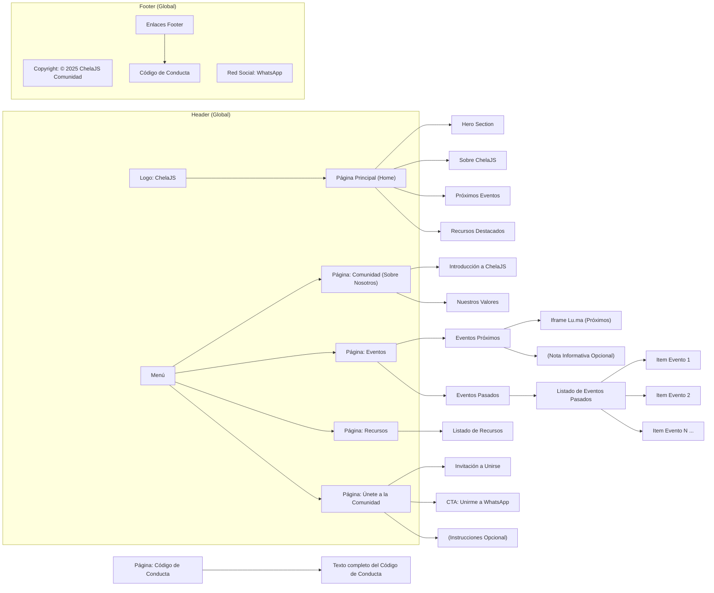

---

**👤 role: user**

---
---
---

Diseña el sitio web para la comunidad Chelajs. Esta comunidad busca crear un espacio para reunir a profesionales y entusiastas de la tecnología. Busca conectar talentos, compartir problemas y soluciones y formar comunidad.

---
---

La página del evento será un iframe de los eventos publicados en lu.ma solo para próximos eventos.

---
---

La página de contacto reemplázala por la de unirse a la comunidad, tenemos un link para unirse al WhatsApp.

---
---

La página de eventos debe tener los eventos pasados.

---
---

Los eventos pasados no serán un iframe.

---
---

El año para el footer es 2025, las redes sociales son solo WhatsApp.

---
---

Agrega un enlace al código de conducta al footer.

---

**👤 role: model**

---
---
---

# Sitemap Completo:

## Secciones Globales (Header y Footer):

**1. Header (Global)**

*   **Logo:**
    *   Texto: ChelaJS (o logo gráfico si existe)
    *   Enlace: Página principal (Home)

*   **Menú de Navegación Principal:**
    *   Enlace: Comunidad (Página "Sobre Nosotros")
    *   Enlace: Eventos (Página "Eventos")
    *   Enlace: Recursos (Página "Recursos")
    *   Enlace: Únete (Página "Únete a la Comunidad")

**2. Footer (Global)**

*   **Copyright:**
    *   Texto: © 2025 ChelaJS Comunidad. Todos los derechos reservados.

*   **Enlaces Footer:**
    *   **Código de Conducta:**
        *   Enlace: Página "Código de Conducta"

*   **Enlaces Sociales:**
    *   Icono de WhatsApp
    *   Enlace al grupo de WhatsApp de ChelaJS.

---

## Páginas del Sitio Web:

**3. Página Principal (Home)**

*   **Secciones:**

    *   **Hero Section (Sección Principal):**
        *   **Título Principal:** ChelaJS: Comunidad de Profesionales y Entusiastas de Tecnología
        *   **Subtítulo Conciso:** Conectando talento, compartiendo conocimiento y construyendo comunidad.
        *   **Llamada a la Acción (CTA):** Botón "Únete a la Comunidad" (Enlaza a la sección "Sobre ChelaJS" o a la página "Únete a la Comunidad").

    *   **Sobre ChelaJS (Sección Introductoria):**
        *   **Título:** Sobre ChelaJS
        *   **Párrafo Breve:** Explicación concisa de qué es ChelaJS, su propósito y a quién va dirigida la comunidad.  Enfocar en la conexión, el aprendizaje colaborativo y el crecimiento profesional.
        *   **Viñetas (Opcional):**  Resaltar 2-3 beneficios clave de unirse a ChelaJS (ej. networking, acceso a recursos, eventos exclusivos).

    *   **Próximos Eventos (Sección Destacada):**
        *   **Título:** Próximos Eventos
        *   **Listado Breve (2-3 Eventos):**  Mostrar los eventos más próximos con título, fecha y una breve descripción.
        *   **Enlace:** Botón "Ver todos los Eventos" (Enlaza a la página "Eventos").
        *   **Mensaje Alternativo (Si no hay eventos):** "Mantente atento a nuestros próximos eventos. ¡Pronto tendremos novedades!"

    *   **Recursos Destacados (Sección de Recursos):**
        *   **Título:** Recursos para la Comunidad
        *   **Listado Breve (2-3 Recursos):**  Mostrar recursos relevantes o categorías de recursos disponibles (ej. artículos, guías, enlaces útiles).
        *   **Enlace:** Botón "Explorar Recursos" (Enlaza a la página "Recursos").

**4. Página: Comunidad (Sobre Nosotros)**

*   **Secciones:**

    *   **Título de Página:** Comunidad ChelaJS (o Sobre Nosotros)

    *   **Introducción a ChelaJS (Sección Principal):**
        *   **Título:**  Bienvenido a la Comunidad ChelaJS
        *   **Párrafos:**  Descripción más detallada de ChelaJS. Ampliar la misión, visión y valores de la comunidad.  Explicar para quién es la comunidad y qué pueden esperar los miembros.  (Énfasis en la colaboración, el crecimiento profesional y el apoyo mutuo).

    *   **Nuestros Valores (Sección de Valores):**
        *   **Título:**  Nuestros Valores
        *   **Listado de Valores (3-4):**  Enumerar los valores fundamentales de la comunidad ChelaJS (ej. Colaboración, Aprendizaje Continuo, Inclusión, Innovación, Respeto).  Breve descripción de cada valor.

**5. Página: Eventos**

*   **Secciones:**

    *   **Título de Página:** Eventos

    *   **Eventos Próximos (Sección Principal):**
        *   **Título:**  Próximos Eventos
        *   **Contenido:**
            *   **Iframe de Lu.ma (Próximos Eventos):**  Integrar un iframe para eventos **próximos**.
            *   **Nota Informativa (Opcional):**  Texto informativo sobre los eventos próximos.

    *   **Eventos Pasados (Sección Secundaria):**
        *   **Título:**  Eventos Pasados (o Ediciones Anteriores)
        *   **Subtítulo Opcional:** "Revive nuestros eventos anteriores y descubre todo lo que hemos compartido."
        *   **Contenido:**
            *   **Listado de Eventos Pasados:**  Listado manual de eventos pasados con título, fecha, descripción (opcional) y enlace a materiales (opcional).

**6. Página: Recursos**

*   **Secciones:**

    *   **Título de Página:** Recursos

    *   **Listado de Recursos (Sección Principal):**
        *   **Título:**  Explora Nuestros Recursos
        *   **Organización:**  Listado de categorías de recursos o listado directo de recursos.
        *   **Tipos de Recursos:**  Artículos, tutoriales, guías, enlaces a herramientas útiles, documentación relevante, etc.
        *   **Breve Descripción por Recurso/Categoría:**  Descripción concisa de cada recurso o categoría.

**7. Página: Únete a la Comunidad**

*   **Secciones:**

    *   **Título de Página:** Únete a la Comunidad (o Sumate a ChelaJS)

    *   **Invitación a Unirse (Sección Principal):**
        *   **Título:** Únete a la Comunidad ChelaJS en WhatsApp
        *   **Párrafo Breve:**  Texto conciso invitando a unirse a WhatsApp y resaltando beneficios.
        *   **Llamada a la Acción (CTA) Principal:**
            *   **Botón:** "Unirme al Grupo de WhatsApp"
            *   **Enlace:**  Enlace al grupo de WhatsApp.

**8. Página: Código de Conducta**
*   **Secciones:**
    *   **Título de Página:** Código de Conducta
    *   **Contenido:**
        *   **Texto:**  Texto completo del código de conducta de la comunidad ChelaJS.  Debe cubrir expectativas de comportamiento,  acciones prohibidas, proceso de reporte de incidentes y consecuencias de violaciones al código.

## Diagrama

